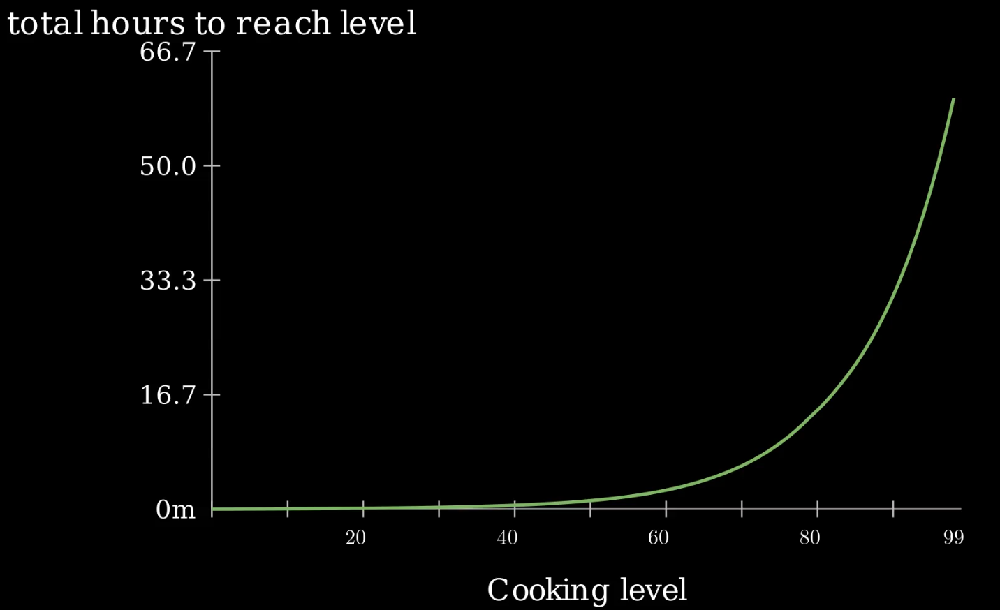
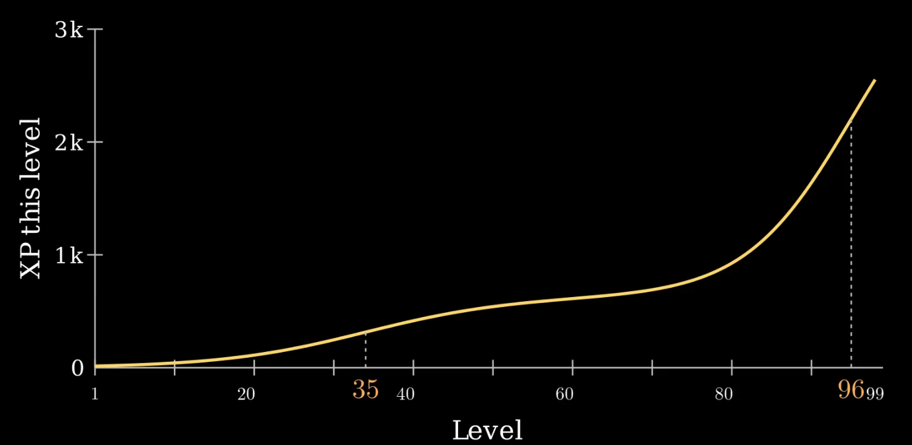
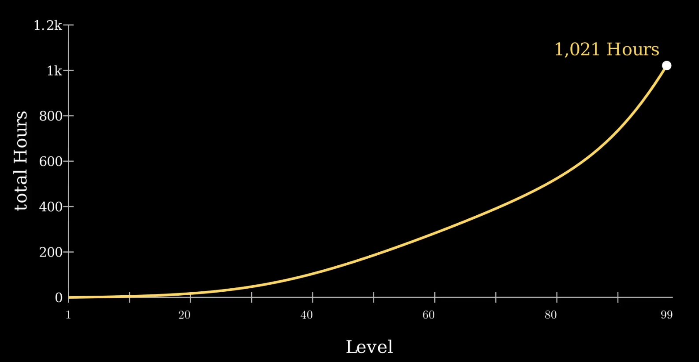

I wanted practising a real skill in Skillorum to feel like levelling in an RPG. This raises the fundamental question: how long should a level take?

Make the levels too fast and they mean nothing, make them too slow and it gets far too dull to bother. To figure this out, I tried to reverse engineer how mastering a skill in real life feels.

Mastering a skill seems so simple: you practice, you get better, you eventually can do even better things and practice more and you get even better. Easy. That's how people learn to draw hands somehow. But how much time does it take to become a master in something?

## Videogames
Videogames have two tools to do this: the XP curve, which is the amount of XP required to get each level; and the rate of XP, which depends on all sorts of things — most importantly your level, the higher your level, the higher XP rate.

Games generally just go with the bog-standard exponential function for the XP curve. It's trusty, it's never going to fail you. Developers often never expect you to max out a skill in a game, it kind of just becomes some unreachable ceiling that there's no point for you to get to. The RuneScape creators never thought anyone would get any skill to level 99. There was barely any reason to. Imagine how they feel now with thousands of people running around with all their skills maxed out.

Looking at one example, in RuneScape cooking, for a standard training method of just cooking fish as you unlock them, your XP rate rises linearly with your level. You can calculate your XP rate for each level and use the XP chart to determine how long it takes to get each level.

You can see that despite the XP rate increasing linearly with the level, since the XP required to reach the next level is (pretty much) exponential, the time taken to get to the next level is barely affected and the time between levels remains roughly exponential.

The problem is: the whole point of Skillorum is to have 1 minute being equivalent to 1 XP, therefore the XP rate is equal at all levels. There is the skill action system, where you get an XP bonus on completing a task with a connected skill action, but again, this is independent of level, so the XP rate is still constant. So where most games can adjust both the XP needed for the next level and the XP rate at a level, Skillorum can't. The curve alone determines how long a level in Skillorum takes.

## Real Life Mastery
As someone who has spent days grinding out 99s, I was surprised about this analysis. I can say that the feeling is completely different. The early levels come very fast, the first levels are barely minutes between, which is probably what hooks you to start with. The dopamine release you get each time you level up just gets better the higher the level.

The time between levels of course gets longer, but when you get to around level 40, it feels like it barely changes, like the difference between 41 and 42 and 59 and 60 aren't that different. Eventually, when you get in the 70s it feels awfully slow. Hours between levels. 90s feel like forever, but when you're 96 and you know it's just 3 levels left, they somehow come pretty quickly.

This is just my subjective experience, but I think it's important to take that into account. It almost feels like it comes in steps and plateaus. Perhaps I just grinded it out more when I was close to 99, or maybe splurged some extra gold to get there faster, but either way, it felt like it was almost there at level 96, despite it still having more than a quarter of the total XP to go.

You can see the graphs and everything in my [video](https://youtu.be/6ZwpBOYmWB4), but looking at real-life examples of skills, the main thing you learn is that everyone is at their own pace. That path often wiggles and sometimes even goes down, however the one thing that stays constant is that early practice grants much more improvement than later; you learn much more in an hour if it's your first than if it's your thousandth. This follows the adage that 80% of the knowledge takes 20% of the time.

## Skillorum's Curve
I think it's important to consider motivation when designing the XP curve. Firstly, even if I wanted to make level 99 be 10,000 hours, it just wouldn't work, with the average level taking over 100 hours, not many people are going to get past that. Although you need to also not make it too easy otherwise levelling up doesn't feel like an achievement. Anyway, if you could do something for 100 hours with no kind of tricks or external input, you don't need Skillorum anyway. You go conquer the world.

Now I can use what we learnt to choose how to make the XP to next level curve look:

1. Max level is 99.
2. Level 2 should take about 15 minutes.
3. Early levels arrive quickly and progress should slow coming to the mid levels. Mimicking the difficulty curve of being competent.
4. The increase should flatten around the middle levels.
5. Time taken to next level increase should start ramping up again around level 70.
6. Slow down rate of increase a little at around level 96.
7. Level 80 should be around half the total time (20% would mean the later levels would take far too long).
8. Level 50 should take around 150-200 hours.

To model this, I used a bi-sigmoidal function since this allows for two ramp ups. I pretty much just fiddled with the constants until the curve fit the constraints. This is the formula Skillorum uses to get the XP required to get to level $L$ from level $L - 1$ (for $L>1$).

$$
f(L) = 420[\frac{1.5}{1+e^{-0.11(L-35)}}+\frac{7.5}{1+e^{-0.15(L-96)}}]
$$

You can do a cumulative sum on this to get the total XP at each level and it looks fairly similar to the exponential curves, but you can see that it is somewhat more linear in the middle while still having a curve.

I actually unintentionally ended up making the total XP taken to get to level 99 be around a thousand hours (1,021 and 17 minutes). I'd say this is pretty ideal. Most people would be very happy to have done something worthwhile for 1,000 hours, and it is very possible to do that. It's about 19 hours a week for a year, so you can manage to hit 1,000 hours in anything new if you treat it like a part-time job.

Now, many could argue that this isn't realistic and they wouldn't be wrong. This curve is supposed to model the _feeling_ of mastering a skill. If you've ever spent a lot of time at something, you know how it feels to make so much progress in the beginning and then when you're considered "good", just getting 5% better is painfully difficult and tricky to even measure. Nobody follows the same path to mastery, so how could you make some one-size-fits-all XP curve for mastery?

That bi-sigmoidal mess isn't trying to match reality, I mean, can you give some quantifiable "level" on your guitar skill? It gets nice quick wins early on so you don't bail in week one. The mid-levels are a slog because they are, but getting level 50 and being a decent amateur feels earned.

The problem is for what to do after 99. I'm planning on making a prestige system, so then people can start again, but then they know that they've done 1,000 hours each prestige rank they have. Nobody is close to 99 in any skill yet, so if you want to be the first and force me to implement it, please go ahead.

Anyway, this is what's up in Skillorum right now. Yes, level 99 is one thousand hours. I'm not sorry. If you're interested in Skillorum, you've probably poured at least a thousand hours into some game and felt weird about it (like me). This isn't to make the grind shorter, it's to make it feel better and get you through it.

I can’t make the grind shorter. I just want to point it towards something I’d be glad to have spent a thousand hours doing.